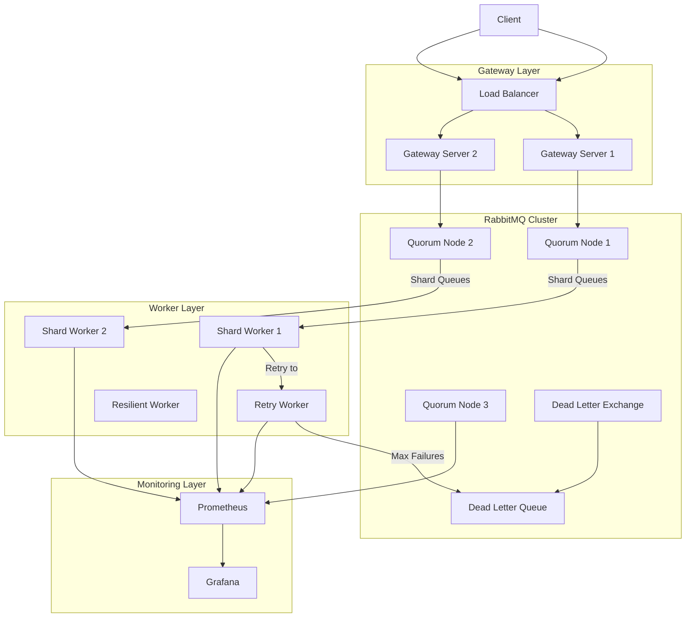

# Distributed Messaging System with RabbitMQ

> **A production-grade distributed messaging system built with Go, RabbitMQ, Redis, and Prometheus. Features include dynamic autoscaling, quorum queues, load-balanced gateway servers, Google OAuth2 authentication, advanced monitoring, and fault-tolerant node recovery.**

---

## ✨ Features

- **RabbitMQ Clustering** with quorum queues (Raft-based consensus)
- **Autoscaling Workers** based on queue depth
- **Load Balancing** across multiple gateway servers
- **Secure Authentication** using Google OAuth2
- **Header, Direct, Topic, Fanout Exchanges** fully utilized
- **Retry & Dead Letter Queues (DLQ)**
- **Redis-based Rate Limiting**
- **Prometheus + Grafana Monitoring**
- **Dockerized Setup** for easy deployment
- **Quorum Recovery Handler** for automatic node healing

---

## 🛠️ Tech Stack

- **Golang** (Concurrency, Channels)
- **RabbitMQ** (Messaging backbone)
- **Redis** (Token Cache, Rate Limiting)
- **Docker** (Containerization)
- **Prometheus** (Monitoring)
- **Grafana** (Visualization)

---

## 🖥️ System Architecture




---

## 🚀 Setup

```bash
# Clone the repository
$ git clone https://github.com/yourusername/distributed-messaging-system.git

# Spin up RabbitMQ cluster, Redis, Prometheus, Grafana
$ docker-compose up -d

# Run gateway servers
$ go run gateway/server.go

# Start worker pool
$ go run worker/main.go
```

---

## 📈 Monitoring Metrics

- `rabbitmq_queue_depth`
- `rabbitmq_dlq_depth`
- `rabbitmq_live_workers`
- `rabbitmq_messages_published`
- `rabbitmq_messages_acknowledged`
- `rabbitmq_task_latency_ms`

> Visualize all live metrics on a stunning custom Grafana dashboard!

---

## 🔒 Authentication Flow

- Google OAuth2 Authentication
- Redis caching for session tokens (expiry: 5 min)
- JWT tokens used for secured API access

---

## 🛡️ Fault Tolerance

- Quorum recovery when any RabbitMQ node fails
- Auto-scaling workers when queue load spikes
- Retry queues with exponential backoff for failed tasks

---

---

## 🙌 Acknowledgements

- RabbitMQ Official Documentation
- Prometheus and Grafana Community
- Go gRPC and Concurrency Best Practices
